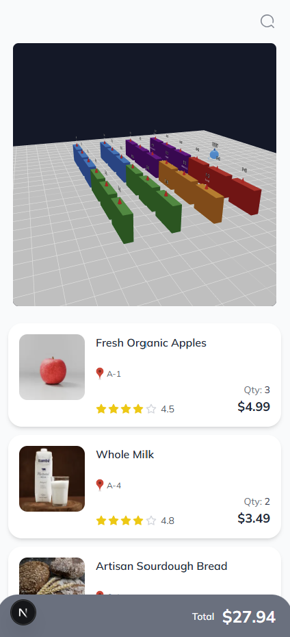
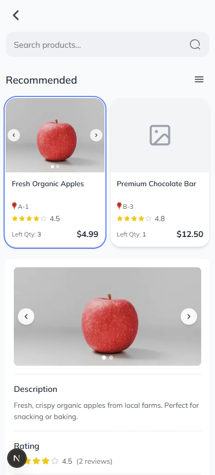

<div align="center">

# 🛒 Smart Shopping Cart

### 실시간 스마트 장바구니 시스템

<br/>

[](https://nextjs.org/)
[](https://react.dev/)
[](https://www.typescriptlang.org/)
[](https://tailwindcss.com/)
[](https://threejs.org/)

<br/>


</div>

<br/>

---

<br/>

## � Preview

<div align="center">
  <table>
    <tr>
      <td align="center">
        
        <br/>
        <b>🛒 Cart Page</b>
        <br/>
        <sub>3D 매장 지도 + 장바구니</sub>
      </td>
      <td align="center">
        
        <br/>
        <b>🔍 Search Page</b>
        <br/>
        <sub>실시간 검색 + 추천 상품</sub>
      </td>
    </tr>
  </table>
</div>

<br/>

---

<br/>

## �🚀 Quick Start

```bash
# 의존성 설치
npm install

# 개발 서버 실행
npm run dev

# 브라우저에서 확인
open http://localhost:3000
```

<br/>

---

<br/>

## 🛠️ Tech Stack

<table>
  <tr>
    <th align="center">Category</th>
    <th align="center">Technology</th>
    <th align="center">Description</th>
  </tr>
  <tr>
    <td rowspan="3" align="center"><b>🎯 Core</b></td>
    <td> Next.js 16</td>
    <td>React 프레임워크 (App Router)</td>
  </tr>
  <tr>
    <td> React 19</td>
    <td>UI 라이브러리</td>
  </tr>
  <tr>
    <td> TypeScript 5</td>
    <td>타입 안전성</td>
  </tr>
  <tr>
    <td align="center"><b>🎨 Styling</b></td>
    <td> Tailwind CSS 4</td>
    <td>유틸리티 기반 CSS</td>
  </tr>
  <tr>
    <td rowspan="2" align="center"><b>🌐 3D</b></td>
    <td> Three.js</td>
    <td>3D 렌더링 엔진</td>
  </tr>
  <tr>
    <td>React Three Fiber</td>
    <td>React용 Three.js 바인딩</td>
  </tr>
</table>

<br/>

---

<br/>

## 📁 Project Structure

```
📦 smart_shopping_cart_front
├── 📂 app
│   ├── 📂 cart          # 🛒 장바구니 페이지 (메인)
│   ├── 📂 search        # 🔍 검색 & 추천 페이지
│   └── 📂 ui-kit        # 🎨 컴포넌트 쇼케이스
│
├── 📂 components
│   ├── 📂 common        # 공통 컴포넌트
│   ├── 📂 icons         # SVG 아이콘
│   ├── 📂 layout        # 레이아웃 (Footer 등)
│   ├── 📂 map           # 3D 매장 지도
│   └── 📂 ui            # UI 컴포넌트
│       ├── 📂 buttons
│       ├── 📂 product
│       └── 📂 review
│
└── 📂 public            # 정적 파일
```

<br/>

---

<br/>

## 🎨 Components

<details>
<summary><b>📱 Pages</b></summary>
<br/>

| 페이지 | 경로 | 설명 |
|:------:|:----:|:-----|
| 🛒 **Cart** | `/cart` | 장바구니 + 3D 매장 지도 |
| 🔍 **Search** | `/search` | 실시간 검색 + 추천 상품 |
| 🎨 **UI Kit** | `/ui-kit` | 컴포넌트 쇼케이스 |

</details>

<details>
<summary><b>🏷️ Product Cards</b></summary>
<br/>

| 컴포넌트 | 용도 |
|:--------:|:-----|
| `ProductCard` | 가로형 상품 카드 (장바구니용) |
| `ProductGridCard` | 그리드형 상품 카드 (탐색용) |
| `ExpandableProductCard` | 클릭 시 상세 정보 확장 |
| `ExpandableProductGridCard` | 그리드 + 확장 기능 |

</details>

<details>
<summary><b>🗺️ 3D Store Map</b></summary>
<br/>

```tsx
<StoreMap 
  locations={productLocations}       // 상품 위치
  layout={{ gridSize, shelfSpacing }} // 매장 레이아웃
  userPosition={{ x, y, z }}         // 사용자 위치
/>
```

| 기능 | 조작 |
|:----:|:-----|
| 🖱️ **회전** | 드래그 |
| 🔍 **줌** | 스크롤 |
| 📍 **상품** | 빨간 마커 |
| 🔵 **사용자** | 파란 마커 |

</details>

<br/>

---

<br/>

## ⚡ Key Features

<table>
  <tr>
    <td align="center" width="33%">
      <h3>🔍</h3>
      <b>실시간 검색</b>
      <br/><br/>
      타이핑과 동시에<br/>즉시 결과 표시
    </td>
    <td align="center" width="33%">
      <h3>🗺️</h3>
      <b>3D 매장 지도</b>
      <br/><br/>
      Three.js 기반<br/>인터랙티브 지도
    </td>
    <td align="center" width="33%">
      <h3>📱</h3>
      <b>모바일 최적화</b>
      <br/><br/>
      Mobile First<br/>반응형 디자인
    </td>
  </tr>
  <tr>
    <td align="center">
      <h3>🖼️</h3>
      <b>이미지 캐러셀</b>
      <br/><br/>
      상품별 다중<br/>이미지 지원
    </td>
    <td align="center">
      <h3>📍</h3>
      <b>위치 표시</b>
      <br/><br/>
      상품 위치 정보<br/>(A-1, B-3 등)
    </td>
    <td align="center">
      <h3>⭐</h3>
      <b>별점 & 리뷰</b>
      <br/><br/>
      상품 평점 및<br/>리뷰 표시
    </td>
  </tr>
</table>

<br/>

---

<br/>

## 🔧 Development

```bash
# 개발 서버
npm run dev

# 프로덕션 빌드
npm run build && npm start

# 린트 검사
npm run lint
```

<br/>

### 📱 모바일 테스트

```bash
# ngrok 설치
npm install -g ngrok

# 터널 생성
ngrok http 3000

# 출력된 URL로 모바일 접속
# https://xxxx.ngrok-free.app
```

<br/>

---

<br/>

## 🌐 API Endpoints (예정)

| Method | Endpoint | Description |
|:------:|:---------|:------------|
| `GET` | `/api/cart` | 장바구니 조회 |
| `GET` | `/api/search` | 상품 검색 |
| `GET` | `/api/map` | 매장 지도 데이터 |
| `WS` | `/api/location` | 실시간 위치 |

<br/>

---

<br/>

<div align="center">

## 📄 License

MIT License

<br/>

---

<br/>

Made with ❤️ by **Smart Shopping Cart Team**

<br/>

[](https://github.com)

</div>
